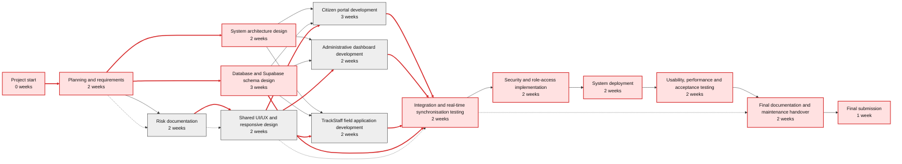

# TrackServ PERT Chart - Updated Post-Implementation Plan

## Legend

- Red arrows represent the critical path.
- Black arrows represent non-critical or parallel work.
- Durations are estimated in weeks and reflect the delivered three-application system.

## Updated PERT chart

## Activity definitions and dependencies

| ID  | Activity                                          | Duration | Depends on | Path         |
| --- | ------------------------------------------------- | -------: | ---------- | ------------ |
| A   | Project start                                     |  0 weeks | None       | Critical     |
| B   | Planning and requirements                         |  2 weeks | A          | Critical     |
| C   | System architecture design                        |  2 weeks | B          | Critical     |
| D   | Database and Supabase schema design               |  3 weeks | B          | Critical     |
| E   | Risk documentation                                |  2 weeks | B          | Non-critical |
| F   | Citizen portal development                        |  3 weeks | C, D, I    | Parallel     |
| G   | Administrative dashboard development              |  2 weeks | C, D, I    | Parallel     |
| H   | TrackStaff field application development          |  2 weeks | C, D, I    | Parallel     |
| I   | Shared UI/UX and responsive design                |  2 weeks | E          | Non-critical |
| J   | Integration and real-time synchronisation testing |  2 weeks | D, F, G, H | Critical     |
| K   | Security and role-access implementation           |  2 weeks | J          | Critical     |
| L   | System deployment                                 |  2 weeks | K          | Critical     |
| M   | Usability, performance and acceptance testing     |  2 weeks | L          | Critical     |
| N   | Final documentation and maintenance handover      |  2 weeks | M          | Critical     |
| O   | Final submission                                  |   1 week | N          | Critical     |

## Critical path

Project start -> Planning and requirements -> System architecture design / Supabase schema design -> Integration and real-time synchronisation testing -> Security and role-access implementation -> System deployment -> Usability, performance and acceptance testing -> Final documentation and maintenance handover -> Final submission.

The citizen portal, administrative dashboard, TrackStaff field application, and shared UI/UX work are parallel activities. They must all be complete before integration testing can finish.

## Changes from the original chart

- Replaced the planned Node.js/PHP backend development activity with Supabase PostgreSQL schema and backend configuration.
- Added the separate administrative dashboard as a delivery stream.
- Added the TrackStaff field application as a delivery stream.
- Added explicit real-time synchronisation and cross-application integration testing.
- Added role-based access and row-level-security implementation as a distinct activity.
- Replaced generic geolocation API work with integration across citizen reporting, admin operations, and staff assigned-issue views.
- Added acceptance testing that covers citizen, administrator, and field-staff workflows.
- Added documentation and maintenance handover after deployment.
